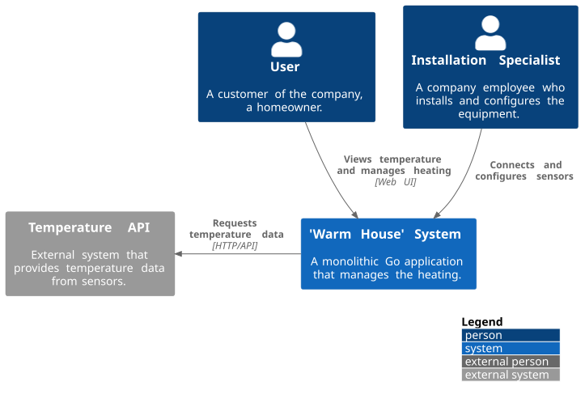
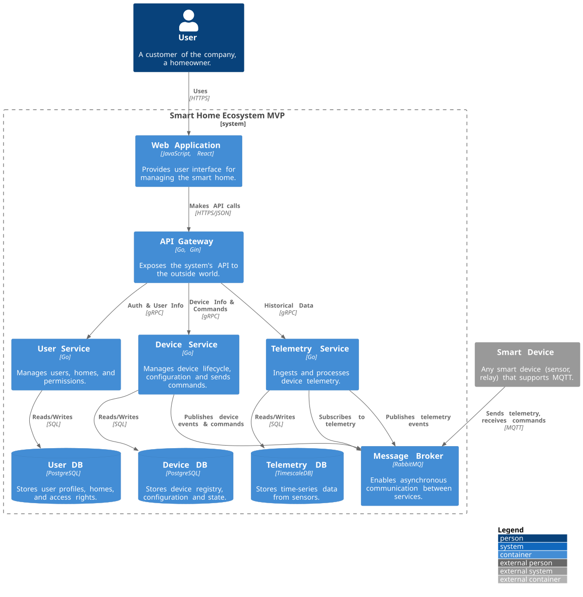
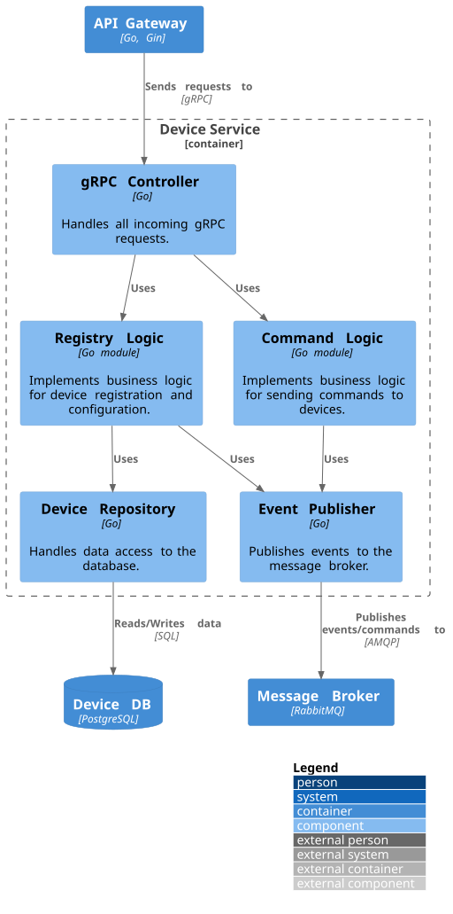
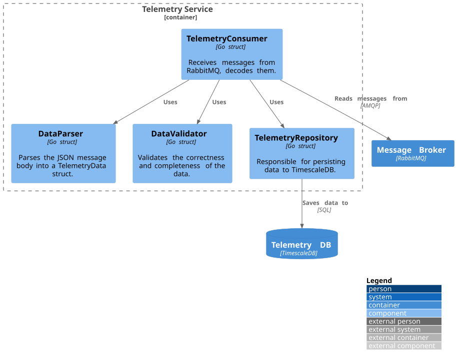
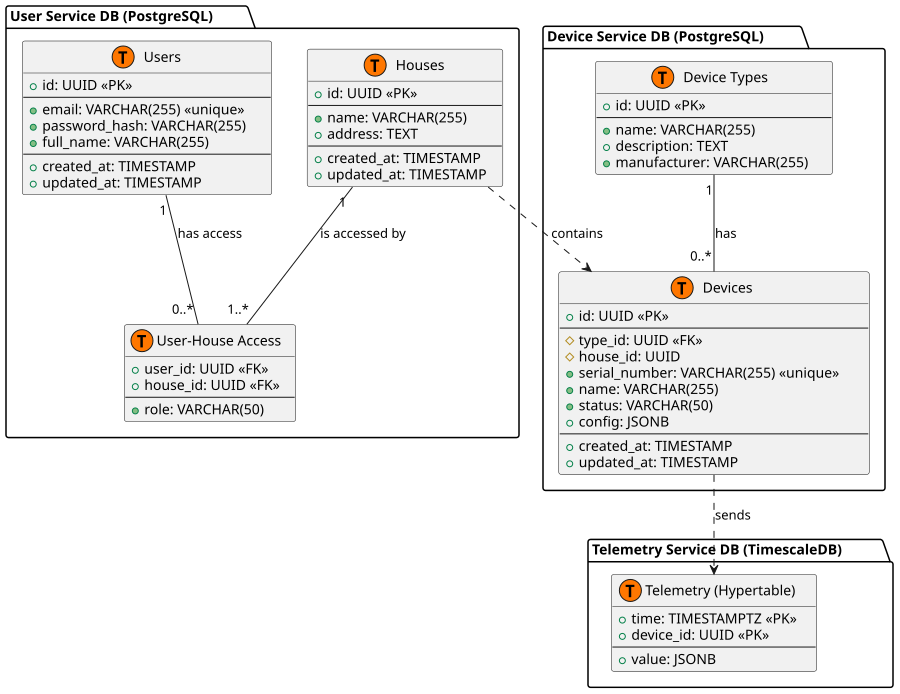

# Project_template

Это шаблон для решения проектной работы. Структура этого файла повторяет структуру заданий. Заполняйте его по мере работы над решением.

# Задание 1. Анализ и планирование

<aside>

Чтобы составить документ с описанием текущей архитектуры приложения, можно часть информации взять из описания компании и условия задания. Это нормально.

</aside

### 1. Описание функциональности монолитного приложения

**Управление отоплением:**

- Пользователи могут удаленно изменять состояние датчиков (например, включать/выключать отопление) через `PATCH` запрос.
- Система поддерживает CRUD-операции для управления датчиками (создание, чтение, обновление, удаление).
- Система спроектирована для работы с различными типами датчиков, а не только с отоплением.

**Мониторинг температуры:**

- Пользователи могут просматривать текущую температуру в своих домах через веб-интерфейс.
- Система получает данные о температуре с датчиков путем прямого синхронного запроса к внешнему `temperature-api`.
- Данные о последнем значении и статусе обновляются в реальном времени при каждом запросе информации о датчике.

### 2. Анализ архитектуры монолитного приложения

- **Язык программирования:** Go
- **База данных:** PostgreSQL
- **Архитектура:** Монолитная, с логическим разделением на слои (handlers, services, db, models).
- **Взаимодействие:** Синхронное. Все вызовы, включая запросы к внешним API, являются блокирующими.
- **Масштабируемость:** Ограничена. Масштабирование возможно только путем запуска нескольких копий всего приложения.
- **Развертывание:** Требует остановки и перезапуска всего приложения.

### 3. Определение доменов и границы контекстов

В текущем монолите можно выделить два основных домена:
1.  **Управление устройствами (Device Management):** Отвечает за жизненный цикл датчиков — их регистрацию, обновление и удаление.
2.  **Мониторинг телеметрии (Telemetry Monitoring):** Отвечает за получение и отображение текущих данных с датчиков.

### **4. Проблемы монолитного решения**

- **Низкая скорость разработки:** Любое изменение требует тестирования и развертывания всего приложения.
- **Сложность масштабирования:** Синхронные запросы к датчикам создают "узкое место" и не позволяют масштабировать компоненты по отдельности.
- **Низкая отказоустойчивость:** Ошибка в одном компоненте может привести к отказу всей системы.
- **Технологические ограничения:** Вся система привязана к одному стеку (Go + PostgreSQL), что не позволяет использовать более подходящие инструменты для конкретных задач (например, Time-Series DB для телеметрии).

Если вы считаете, что текущее решение не вызывает проблем, аргументируйте свою позицию.

### 5. Визуализация контекста системы — диаграмма С4

Добавьте сюда диаграмму контекста в модели C4.



Чтобы добавить ссылку в файл Readme.md, нужно использовать синтаксис Markdown. Это делают так:

```markdown
[Текст ссылки](URL)
```

Замените `Текст ссылки` текстом, который хотите использовать для ссылки. Вместо `URL` вставьте адрес, на который должна вести ссылка. Например:

```markdown
[Посетите Яндекс](https://ya.ru/)
```

# Задание 2. Проектирование микросервисной архитектуры

### 1. Декомпозиция на микросервисы

В будущей системе можно выделить несколько логических частей (доменов):
- **Пользователи и дома:** всё, что связано с аккаунтами и доступом.
- **Устройства:** реестр всех датчиков и управление ими.
- **Телеметрия:** сбор и обработка данных с датчиков.
- **Сценарии:** автоматизация работы устройств.

В идеале, каждая часть могла бы стать отдельным микросервисом. Но для быстрой разработки и запуска (MVP), мы объединили самые близкие по смыслу домены в три сервиса: `User Service`, `Device Service` и `Telemetry Service`. Это упрощает поддержку на старте, но оставляет возможность в будущем разделить сервисы, если потребуется.

### 2. Диаграмма контейнеров (Containers) - План MVP



### 3. Диаграмма компонентов (Components) - DeviceService

Эта диаграмма показывает внутреннее устройство сервиса `DeviceService`. Он состоит из нескольких логических блоков, которые отвечают за регистрацию устройств и отправку им команд. Такое разделение позволит в будущем легко выделить эти блоки в отдельные микросервисы.



### Диаграмма кода (Code)




# Задание 3. Разработка ER-диаграммы

Добавьте сюда ER-диаграмму. Она должна отражать ключевые сущности системы, их атрибуты и тип связей между ними.



# Задание 4. Создание и документирование API

### 1. Тип API

На основе проведенного анализа, мы выбрали **гибридную архитектуру API**:
1.  **gRPC** для высокопроизводительного **внутреннего взаимодействия** между API Gateway и микросервисами (`User`, `Device`, `Telemetry`).
2.  **REST API** (на основе OpenAPI) для **публичного доступа**, используемого внешними клиентами (веб-приложение).
3.  **AsyncAPI** для описания **асинхронного взаимодействия** при приеме телеметрии через брокер сообщений `RabbitMQ`.

Такой подход позволяет нам использовать сильные стороны каждой технологии: производительность и строгую типизацию gRPC для внутренних вызовов, а также простоту и совместимость REST для внешних клиентов.

### 2. Документация API

Контракты, описывающие API наших сервисов, находятся в следующих файлах:

*   **gRPC Контракты (Protobuf):**
    *   [`contracts/proto/user/user.proto`](contracts/proto/user/user.proto): Определяет API для `UserService` (управление пользователями и домами).
    *   [`contracts/proto/device/device.proto`](contracts/proto/device/device.proto): Определяет API для `DeviceService` (управление устройствами и их типами).
    *   [`contracts/proto/telemetry/telemetry.proto`](contracts/proto/telemetry/telemetry.proto): Определяет API для `TelemetryService` (получение исторических данных).

*   **Асинхронный API (AsyncAPI):**
    *   [`contracts/asyncapi.yml`](contracts/asyncapi.yml): Описывает контракт для асинхронного получения данных телеметрии от устройств через брокер сообщений.

# Задание 5. Запуск проекта с помощью Docker

На этом этапе все части нашего приложения "упакованы" в Docker и готовы к запуску одной командой.

### Запуск и проверка

Чтобы запустить проект и убедиться, что все работает:

1.  Откройте терминал в корневой папке проекта.
2.  Выполните команду:
    ```bash
    make test -C apps
    ```
Эта команда автоматически соберет и запустит все сервисы, а затем выполнит интеграционные тесты. В консоль будет выведен только отчет о выполнении тестов.


# Задание 6. Разработка MVP

Мы реализовали MVP, в котором монолит `smart_home` делегирует создание устройств новому микросервису `DeviceService` (Python) через gRPC.

`DeviceService`, в свою очередь, сообщает о новом устройстве в `TelemetryService` (C#) через очередь сообщений RabbitMQ.

### Запуск и проверка

Чтобы запустить проект и убедиться, что все работает:

1.  Откройте терминал в корневой папке проекта.
2.  Выполните команду:
    ```bash
    make test -C apps
    ```
Эта команда автоматически соберет и запустит все сервисы, а затем выполнит интеграционные тесты, которые проверяют правильность работы новых микросервисов и их взаимодействие. В консоль будет выведен только отчет о выполнении тестов.