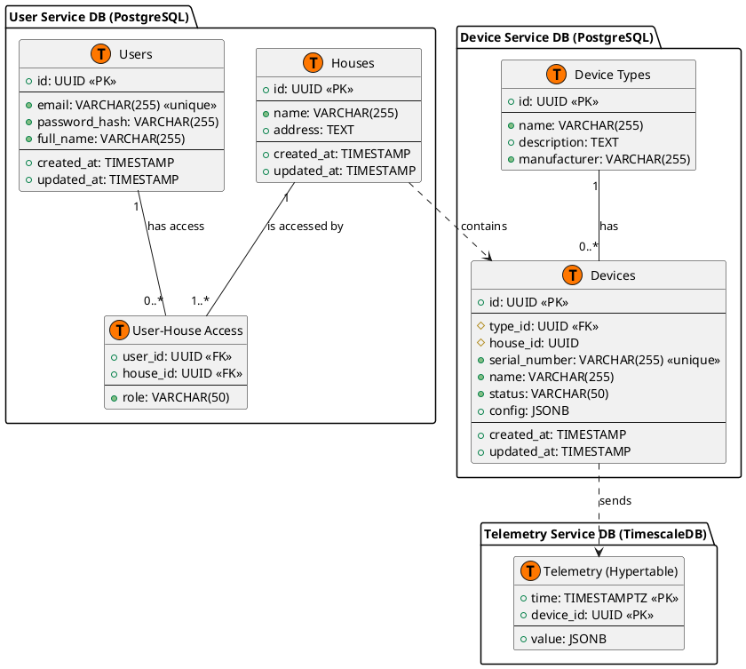

# Project_template

Это шаблон для решения проектной работы. Структура этого файла повторяет структуру заданий. Заполняйте его по мере работы над решением.

# Задание 1. Анализ и планирование

<aside>

Чтобы составить документ с описанием текущей архитектуры приложения, можно часть информации взять из описания компании и условия задания. Это нормально.

</aside

### 1. Описание функциональности монолитного приложения

**Управление отоплением:**

- Пользователи могут удаленно изменять состояние датчиков (например, включать/выключать отопление) через `PATCH` запрос.
- Система поддерживает CRUD-операции для управления датчиками (создание, чтение, обновление, удаление).
- Система спроектирована для работы с различными типами датчиков, а не только с отоплением.

**Мониторинг температуры:**

- Пользователи могут просматривать текущую температуру в своих домах через веб-интерфейс.
- Система получает данные о температуре с датчиков путем прямого синхронного запроса к внешнему `temperature-api`.
- Данные о последнем значении и статусе обновляются в реальном времени при каждом запросе информации о датчике.

### 2. Анализ архитектуры монолитного приложения

- **Язык программирования:** Go
- **База данных:** PostgreSQL
- **Архитектура:** Монолитная, с логическим разделением на слои (handlers, services, db, models).
- **Взаимодействие:** Синхронное. Все вызовы, включая запросы к внешним API, являются блокирующими.
- **Масштабируемость:** Ограничена. Масштабирование возможно только путем запуска нескольких копий всего приложения.
- **Развертывание:** Требует остановки и перезапуска всего приложения.

### 3. Определение доменов и границы контекстов

В текущем монолите можно выделить два основных домена:
1.  **Управление устройствами (Device Management):** Отвечает за жизненный цикл датчиков — их регистрацию, обновление и удаление.
2.  **Мониторинг телеметрии (Telemetry Monitoring):** Отвечает за получение и отображение текущих данных с датчиков.

### **4. Проблемы монолитного решения**

- **Низкая скорость разработки:** Любое изменение требует тестирования и развертывания всего приложения.
- **Сложность масштабирования:** Синхронные запросы к датчикам создают "узкое место" и не позволяют масштабировать компоненты по отдельности.
- **Низкая отказоустойчивость:** Ошибка в одном компоненте может привести к отказу всей системы.
- **Технологические ограничения:** Вся система привязана к одному стеку (Go + PostgreSQL), что не позволяет использовать более подходящие инструменты для конкретных задач (например, Time-Series DB для телеметрии).

Если вы считаете, что текущее решение не вызывает проблем, аргументируйте свою позицию.

### 5. Визуализация контекста системы — диаграмма С4

Добавьте сюда диаграмму контекста в модели C4.

```plantuml
@startuml C4_Context_As_Is
!include https://raw.githubusercontent.com/plantuml-stdlib/C4-PlantUML/master/C4_Context.puml

LAYOUT_WITH_LEGEND()

Person(user, "User", "A customer of the company, a homeowner.")
Person(specialist, "Installation Specialist", "A company employee who installs and configures the equipment.")

System_Ext(temperature_api, "Temperature API", "External system that provides temperature data from sensors.")

System(smart_home_monolith, "'Warm House' System", "A monolithic Go application that manages the heating.")

Rel(user, smart_home_monolith, "Views temperature and manages heating", "Web UI")
Rel(specialist, smart_home_monolith, "Connects and configures sensors")
Rel_L(smart_home_monolith, temperature_api, "Requests temperature data", "HTTP/API")

@enduml
```

Чтобы добавить ссылку в файл Readme.md, нужно использовать синтаксис Markdown. Это делают так:

```markdown
[Текст ссылки](URL)
```

Замените `Текст ссылки` текстом, который хотите использовать для ссылки. Вместо `URL` вставьте адрес, на который должна вести ссылка. Например:

```markdown
[Посетите Яндекс](https://ya.ru/)
```

# Задание 2. Проектирование микросервисной архитектуры

### 1. Декомпозиция на микросервисы

В будущей системе можно выделить несколько логических частей (доменов):
- **Пользователи и дома:** всё, что связано с аккаунтами и доступом.
- **Устройства:** реестр всех датчиков и управление ими.
- **Телеметрия:** сбор и обработка данных с датчиков.
- **Сценарии:** автоматизация работы устройств.

В идеале, каждая часть могла бы стать отдельным микросервисом. Но для быстрой разработки и запуска (MVP), мы объединили самые близкие по смыслу домены в три сервиса: `User Service`, `Device Service` и `Telemetry Service`. Это упрощает поддержку на старте, но оставляет возможность в будущем разделить сервисы, если потребуется.

### 2. Диаграмма контейнеров (Containers) - План MVP

```plantuml
@startuml C4_Container_MVP
!include https://raw.githubusercontent.com/plantuml-stdlib/C4-PlantUML/master/C4_Container.puml

LAYOUT_WITH_LEGEND()

Person(user, "User", "A customer of the company, a homeowner.")

System_Boundary(smart_home_eco, "Smart Home Ecosystem MVP") {
    Container(spa, "Web Application", "JavaScript, React", "Provides user interface for managing the smart home.")
    Container(api_gateway, "API Gateway", "Go, Gin", "Exposes the system's API to the outside world.")

    ContainerDb(user_db, "User DB", "PostgreSQL", "Stores user profiles, homes, and access rights.")
    Container(user_service, "User Service", "Go", "Manages users, homes, and permissions.")

    ContainerDb(device_db, "Device DB", "PostgreSQL", "Stores device registry, configuration and state.")
    Container(device_service, "Device Service", "Go", "Manages device lifecycle, configuration and sends commands.")

    ContainerDb(telemetry_db, "Telemetry DB", "TimescaleDB", "Stores time-series data from sensors.")
    Container(telemetry_service, "Telemetry Service", "Go", "Ingests and processes device telemetry.")

    Container(message_broker, "Message Broker", "RabbitMQ", "Enables asynchronous communication between services.")
}

System_Ext(smart_device, "Smart Device", "Any smart device (sensor, relay) that supports MQTT.")

Rel(user, spa, "Uses", "HTTPS")
Rel(spa, api_gateway, "Makes API calls", "HTTPS/JSON")

Rel(api_gateway, user_service, "Auth & User Info", "gRPC")
Rel(api_gateway, device_service, "Device Info & Commands", "gRPC")
Rel(api_gateway, telemetry_service, "Historical Data", "gRPC")

Rel(user_service, user_db, "Reads/Writes", "SQL")
Rel(device_service, device_db, "Reads/Writes", "SQL")
Rel(telemetry_service, telemetry_db, "Reads/Writes", "SQL")

Rel(device_service, message_broker, "Publishes device events & commands")
Rel(telemetry_service, message_broker, "Publishes telemetry events")

Rel(smart_device, message_broker, "Sends telemetry, receives commands", "MQTT")
Rel(telemetry_service, message_broker, "Subscribes to telemetry")

@enduml
```

### 3. Диаграмма компонентов (Components) - DeviceService

Эта диаграмма показывает внутреннее устройство сервиса `DeviceService`. Он состоит из нескольких логических блоков, которые отвечают за регистрацию устройств и отправку им команд. Такое разделение позволит в будущем легко выделить эти блоки в отдельные микросервисы.

```plantuml
@startuml C4_Component_Device_Service_MVP
!include https://raw.githubusercontent.com/plantuml-stdlib/C4-PlantUML/master/C4_Component.puml

LAYOUT_WITH_LEGEND()

Container(api_gateway, "API Gateway", "Go, Gin")
ContainerDb(device_db, "Device DB", "PostgreSQL")
Container(message_broker, "Message Broker", "RabbitMQ")

Container_Boundary(device_service, "Device Service") {
    Component(grpc_controller, "gRPC Controller", "Go", "Handles all incoming gRPC requests.")
    
    Component(registry_logic, "Registry Logic", "Go module", "Implements business logic for device registration and configuration.")
    Component(command_logic, "Command Logic", "Go module", "Implements business logic for sending commands to devices.")
    
    Component(device_repo, "Device Repository", "Go", "Handles data access to the database.")
    Component(event_publisher, "Event Publisher", "Go", "Publishes events to the message broker.")

    Rel(grpc_controller, registry_logic, "Uses")
    Rel(grpc_controller, command_logic, "Uses")
    Rel(registry_logic, device_repo, "Uses")
    Rel(registry_logic, event_publisher, "Uses")
    Rel(command_logic, event_publisher, "Uses")
}

Rel(api_gateway, grpc_controller, "Sends requests to", "gRPC")
Rel(device_repo, device_db, "Reads/Writes data", "SQL")
Rel(event_publisher, message_broker, "Publishes events/commands to", "AMQP")

@enduml
```

### Диаграмма кода (Code)


```plantuml
@startuml C4_Code_Telemetry_Service
!include https://raw.githubusercontent.com/plantuml-stdlib/C4-PlantUML/master/C4_Component.puml

LAYOUT_WITH_LEGEND()

Container(message_broker, "Message Broker", "RabbitMQ")
ContainerDb(telemetry_db, "Telemetry DB", "TimescaleDB")

Container_Boundary(telemetry_service, "Telemetry Service") {
    Component(consumer, "TelemetryConsumer", "Go struct", "Receives messages from RabbitMQ, decodes them.")
    Component(parser, "DataParser", "Go struct", "Parses the JSON message body into a TelemetryData struct.")
    Component(validator, "DataValidator", "Go struct", "Validates the correctness and completeness of the data.")
    Component(repository, "TelemetryRepository", "Go struct", "Responsible for persisting data to TimescaleDB.")

    Rel(consumer, parser, "Uses")
    Rel(consumer, validator, "Uses")
    Rel(consumer, repository, "Uses")
}

Rel(consumer, message_broker, "Reads messages from", "AMQP")
Rel(repository, telemetry_db, "Saves data to", "SQL")

@enduml
```

# Задание 3. Разработка ER-диаграммы

Добавьте сюда ER-диаграмму. Она должна отражать ключевые сущности системы, их атрибуты и тип связей между ними.



# Задание 4. Создание и документирование API

### 1. Тип API

На основе проведенного анализа, мы выбрали **гибридную архитектуру API**:
1.  **gRPC** для высокопроизводительного **внутреннего взаимодействия** между API Gateway и микросервисами (`User`, `Device`, `Telemetry`).
2.  **REST API** (на основе OpenAPI) для **публичного доступа**, используемого внешними клиентами (веб-приложение).
3.  **AsyncAPI** для описания **асинхронного взаимодействия** при приеме телеметрии через брокер сообщений `RabbitMQ`.

Такой подход позволяет нам использовать сильные стороны каждой технологии: производительность и строгую типизацию gRPC для внутренних вызовов, а также простоту и совместимость REST для внешних клиентов.

### 2. Документация API

Контракты, описывающие API наших сервисов, находятся в следующих файлах:

*   **gRPC Контракты (Protobuf):**
    *   [`contracts/proto/user/user.proto`](contracts/proto/user/user.proto): Определяет API для `UserService` (управление пользователями и домами).
    *   [`contracts/proto/device/device.proto`](contracts/proto/device/device.proto): Определяет API для `DeviceService` (управление устройствами и их типами).
    *   [`contracts/proto/telemetry/telemetry.proto`](contracts/proto/telemetry/telemetry.proto): Определяет API для `TelemetryService` (получение исторических данных).

*   **Асинхронный API (AsyncAPI):**
    *   [`contracts/asyncapi.yml`](contracts/asyncapi.yml): Описывает контракт для асинхронного получения данных телеметрии от устройств через брокер сообщений.

# Задание 5. Работа с docker и docker-compose

В рамках этого задания были реализованы и контейнеризированы два сервиса:

1.  **`smart_home`**: Основное приложение-монолит, которое теперь работает с базой данных PostgreSQL.
2.  **`temperature-api`**: Новый сервис, имитирующий API для получения данных с датчиков температуры.

Оба сервиса, а также база данных PostgreSQL, сконфигурированы для запуска с помощью Docker Compose.

### Как запустить решение

1.  **Перейдите в директорию `apps`**:
    ```bash
    cd apps
    ```

2.  **Запустите все сервисы**:
    Выполните команду в директории `apps`, где находится файл `docker-compose.yml`.
    ```bash
    docker-compose up --build -d
    ```
    Эта команда соберет образы для `smart_home` и `temperature-api` и запустит три контейнера в фоновом режиме: `smart-home-app`, `temperature-api` и `postgres-db`.

### Как проверить работоспособность

Для проверки можно использовать Postman коллекцию smarthome-api.postman_collection.json и вызвать:

- Create Sensor
- Get All Sensors

Должно при каждом вызове отображаться разное значение температуры.


# Задание 6. Разработка MVP

Мы реализовали MVP, в котором монолит `smart_home` делегирует создание устройств новому микросервису `DeviceService` (Python) через gRPC.

`DeviceService`, в свою очередь, сообщает о новом устройстве в `TelemetryService` (C#) через очередь сообщений RabbitMQ.

### Запуск и проверка

1.  В папке `apps` выполните:
    ```bash
    docker-compose up --build
    ```
